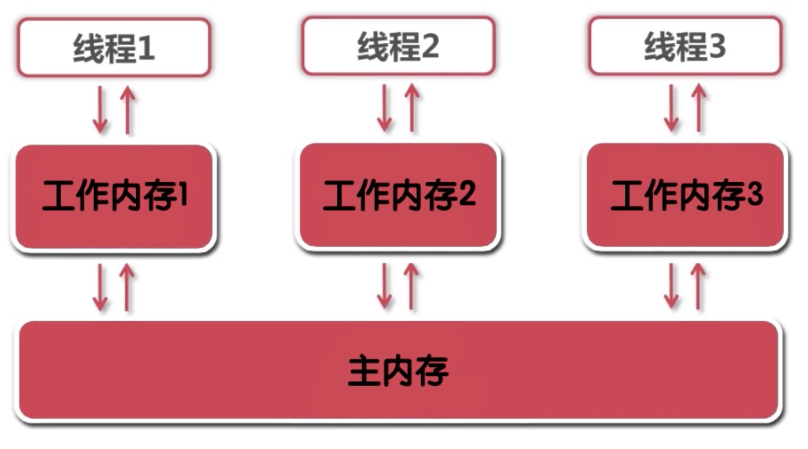

## Java内存模型(JMM)

### Java内存模型的介绍
Java内存模型（Java Memory Model）描述了Java程序中各种变量(线程共享变量)的访问规则，以及在JVM中将`变量(共享变量)`存储到内存和从内存中读取出`变量(共享变量)`这样的底层细节。

在Java内存模型中：
- 所有的变量都存储在`主内存`中。
- 每个线程都有自己独立的工作内存，里面保存该线程使用到的`变量的副本(主内存中该变量的一份拷贝)`。

如图：


### Java内存模型的规定
- 线程对共享变量的所有操作都必须在自己的工作内存中j进行，不能直接从主内存中读写。
- 不同线程之间无法直接访问其他线程工作内存中的变量，线程间变量值的传递需要通过主内存来完成。

## 什么是可见性

### 可见性
一个线程对共享变量值的修改，能够 `及时地被其他线程看到` 称之为可见性。

### 共享变量
如果一个变量在`多个线程的工作内存中都存在副本`，那本这个变量就是这几个线程的共享变量。

## 共享变量在Java线程间的可见性
### 实现原理
要实现共享变量的可见性，必须保证两点：

- 线程修改后的共享变量能够及时从工作内存刷新到主内存。
- 其他线程能够及时把共享变量的最新值从主内存更新到自己的工作内存中。

## Java语言层面支持的可见性实现方式：

### synchronized
JMM中关于synchronized的两条规定:

- 线程解锁前，必须把共享变量的最新值刷新到主内存。
- 线程加锁时，将清空工作内存中共享变量的值，从而使用共享变量时候需要从主内存中重新读取最新的值。

> 注意：锁为同一把锁。

这样，线程解锁前对共享变量的修改在下次加锁时对其他线程可见。

```
线程执行互斥代码的过程：
1. 获得互斥锁
2. 清空工作内存
3. 从主内存拷贝变量的最新副本到工作内存
4. 执行代码
5. 更新共享变量的最新值更新到主内存
6. 释放互斥锁
```

代码实现：代码有可能会被指令重排序
> 指令重排序: 重排序的目的是提高运行并发度，发生在编译器和处理器阶段，遵循as-if-serial语义（不管怎么重排序，单线程程序的执行结果不能改变），也就是重排序所带来的问题是针对多线程的。它包含以下三种优化：
> 
> 1. 编译器优化的重排序（编译器优化）
> 2. 指令级并行重排序（处理器优化）
> 3. 内存系统的重排序（处理器优化）

``` java


public class SynchronizedDemo 
{
	// 共享变量
	private boolean ready = false;
	private int result = 0;
	private int number = 1;
	
	// 写操作
	public void write()
	{
		ready = true; // 1.1
		number = 2;   // 1.2
	}
	
	// 读操作
	public void read(){
		if ( ready )  //2.1
		{
			result = number * 3; //2.2
		}
		System.out.print("result的值为:" + result);
	}
	// 内部线程类
	private class ReadWriteThread extends Thread
	{
		private boolean flag;
		public ReadWriteThread(boolean flag)
		{
			this.flag = flag;
		}
		@Override
		public void run() 
		{
			if ( flag )
			{
				write();
			}
			else
			{
				read();
			}
		}
	}
	
	public static void main(String[] args) 
	{
		SynchronizedDemo demo = new SynchronizedDemo();
		demo.new ReadWriteThread(true).start();
		demo.new ReadWriteThread(false).start();
	}

}

```

上述的代码可能会导致最终结果出现问题，导致共享变量不可见的原因：

- 线程的交叉执行。
- 重排序结合线程交叉执行。
- 共享变量更新后的值没有在工作内存与主内存间及时更新。

安全的代码：

``` java
	public synchronized void write()
	{
		ready = true; // 1.1
		number = 2;   // 1.2
	}
	
	// 读操作
	public synchronized void read(){
		if ( ready )  //2.1
		{
			result = number * 3; //2.2
		}
		System.out.print("result的值为:" + result);
	}
```
synchronized字段如何保证可见性：synchronized拥有`原子性`和`可见性`。

| 不可见的原因         | Synchronized解决方案 |
| ------------------- | ------------------- |
| 线程的交叉执行        |  原子性(同步)         |
| 重排序结合线程交叉执行  | 原子性(同步)         |
| 共享变量未及时更新     | 可见性规范           |

> 加入了synchronized结果仍然会出现`0`：
> 
> 这是由于读线程先执行，先运行了读线程，结果为0。


来源：[慕课网](http://www.imooc.com/learn/352)