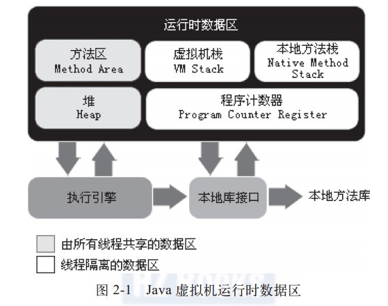

## Java虚拟机

### 虚拟机
- 定义：模拟某种计算机体系结构，执行特定指令集的软件
- 系统虚拟机、进程虚拟机

#### 系统虚拟机
- Virtual Box
- VMware

#### 进程虚拟机（提供特定指令集）
- JVM
- Adobe Flash Player
- FC模拟器

#### Java语言语言虚拟机
- 可以执行Java语言的高级语言虚拟机。Java语言虚拟机并不一定就可以称之为JVM，例如：Apache Harmony

## Java虚拟机
- 必须通过Java TCK（Technology COmpatibility Kit）的兼容性测试的Java语言虚拟机才能称之为“Java虚拟机”
- Java虚拟机并非一定要执行Java程序
- 业界三大商用JVM： Oracle HotSpot、 Oracle JRockitVm、 IBM J9 VM

#### Java虚拟机运行时数据区域
- 在《Java虚拟机规范》中定义了若干种程序运行期间会使用到的存储不同类型数据的区域。
- 有些区域是全局共享的，随着虚拟机启动而创建，随着虚拟机退出而销毁。有些区域是线程私有的，随着线程开始和结束而创建和销毁。
- 是所有Java虚拟机共同的内存区域概念模型。

#### 运行时数据区域的划分

- 程序计数器
- Java堆
- Java虚拟机栈
- 本地方法栈
- 方法区

## 程序计数器
- 一块较小的内存空间，他的作用可以看作是当前线程所执行的字节码的行号指示器。通俗的说可以将其看作一个指针，指向当前程序(字节码)运行的那一行代码。
- 如果线程正在执行的是一个java方法，这个计数器记录的是正在执行的虚拟机字节码指令的地址；如果正在执行的是Native，这个计数器值则为空。
- 此内存区域是唯一一个在Java虚拟机规范中没有规定任何OutOfMemoryError情况的区域。

如图所示：

## Java虚拟机和内存区域

### Java虚拟机栈
为了执行Java字节码服务。

#### 特征
- 线程私有，生命周期与线程相同，Java虚拟机栈描述的是Java方法执行时候描述的内存概念模型。每个方法在执行的时候，都会创建一个栈帧，用来创建这个方法的操作出栈，局部变量表，方法出口，动态链接等信息。每一个方法在调用和结束的过程，就对应了一个栈帧在虚拟机中入栈和出栈的过程。
- 虚拟机栈是一个后进先出（LIFO）栈。
- 存储栈帧，支撑Java方法的调用、执行和退出。
- Java虚拟机栈被设计为可以动态扩展，而动态扩展时无法申请到最够的内存，将会抛出OutOfMemoryError异常。
- 线程请求的栈深度大于Java虚拟机的允许的最大深度将会抛出StackOverflowError异常。

### 本地方法栈
为了执行 Native 方法服务。
#### 特征
- 线程私有。
- 后进先出栈。
- 作用是支撑Native方法的调用、执行和退出。
- 可能出现OutOfMemroyError异常和StackOverflowError异常。
- 有一些虚拟机将Java虚拟机栈和本地方法栈合并实现。

### 栈帧
#### 概念与特征
- Java虚拟机栈中存储的内容，它被设计用于存储数据和部分过程结果的数据结构，同时也被用来处理动态链接、方法返回值和异常分派。
- 一个完整的栈帧包括：局部变量表、操作数栈、动态链接信息、方法正常完成和异常完成信息。

在编译程序代码的时候，需要多大的局部变量表、需要多深的操作数栈就已确定。java编译器会把这些编译信息写入到class文件的code表中。一个栈帧需要分配多大的内存是不会受程序运行期间变量数据的影响，而仅仅取决于具体的java虚拟机。在一个线程里面方法调用的调用链可能会很长，很多方法可能都同时处于执行的状态。

对于执行引擎而言，在活动线程之中，只有位于java虚拟机栈栈顶的那个栈帧才是有效的，这个栈帧被称之为当前栈帧，与这个栈帧相关联的方法称之为当前方法。虚拟机引擎中所有执行的字节码指令都针对当前栈帧和当前方法操作。

### 局部变量表
#### 概念和特征
- 局部变量表是一组变量值的存储空间，它用于存储方法，参数以及方法内部定义的局部变量等等，在Java编译器编译class文件的时候，就在该方法的code属性中确定了该方法所需要的局部变量表的最大容量。

- 局部变量表是由若干个局部变量槽(slot)为最小单位，Java虚拟机规范中并没有指明一个slot应占用的空间大小，有导向性的描述到一个slot都应该能存放一个bool、byte，char，short，int、float、reference以及returnAddress，在这8种数据类型中，他们共同点是都可以通过32位或更小的内存空间来存放，但java虚拟机这样描述slot空间与明确指出每个slot应该使用32位内存空间有一定差别，这样描述允许slot内存空间随着处理器、操作系统或者java虚拟机的具体实现发生变化。

- 假如在64位的java虚拟机之中使用了64位的内存空间去实现slot，java虚拟机仍然要使用对齐或者补排的手段使slot在32位java虚拟机的外观上看起来是一致的。

- 对于64位的数据类型，java虚拟机会以高位对齐的方式来分配两个连续的slot存储这些数据，例如long或double，对于能用两个slot存放64位是与java内存模型中对long和double的非原子性协定有一定相似之处，他们都允许对long和double的内存访问分为两次32位的操作来进行。但是局部变量表是建立在线程堆和栈上，是线程私有的数据，所以无论访问连续的两个slot是否为原子操作都不会引起任何的数据安全问题。java虚拟机也不会允许使用字节码单独访问long和double类型之间任意的slot。java虚拟机通过索引值的方式去定位局部变量表之中的数据。

- 局部变量表用于方法间参数传递，以及方法执行过程中存储局部变量基础数据类型的值对象的引用。在方法执行中，正在调用的方法是一个实例方法，这个方法的局部变量表的`第0号`slot，将默认用于存储这个方法对象所属实例的实例引用，在方法之中可以通过关键字`this`访问到这个隐含的参数。其余的参数按照索引表的顺序来排列，占用从1开始的局部变量slot。参数变量表分配完毕后，再根据方法表之中的局部变量定义顺序和作用于分配剩余的slot。局部变量表中的slot是可以重用的，如果当前字节码的计数器值已经超出了某个变量的作用域，那么这个变量对应的slot就可以交给其他变量使用。

#### reference
对象实例的引用，java虚拟机规范既没有说明一个reference的长度，也没有说明一个reference具备什么样的数据结构，但是java虚拟机至少能通过reference完成两件事情，一是通过reference能直接或间接的查找到对象在java堆中的实例地址，二是可以通过reference能直接或间接的查找到对象所属的数据类型在java方法区中的类型信息。

#### returnAddress 
目前基本不再使用，如果java虚拟机检测到存在returnAddress类型，会在类加载阶段抛出校验异常。

### 操作数栈
#### 概念和特征
- 也成为操作栈，是一个后进先出的栈，操作数栈的最大栈深度在编译期决定，写入到方法表的code属性中。操作数栈有若干个操作数栈元素组成，操作数栈元素称之为Entry。
- 单个Entry即可存储一个Java虚拟机中定义的任意数据类型的值，包括long和double类型，但是存储long和double类型的Entry深度为2，其他类型的深度为1。
- 在方法执行的过程中，栈帧用于存储计算参数和计算结果；在方法调用时，操作数栈也用来准备调用方法的参数以及接受方法返回结果，当一个方法刚开始执行的时候，这个方法的操作数栈是空的，在方法的执行过程中会遇到各种不同的指令码往操作数栈写入和提取内容，这样就构成了操作数栈的出栈和入栈工作。

Java虚拟机的解释执行引擎称为“基于栈的执行引擎”，其中所指的“栈”就是操作数栈。